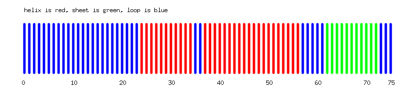
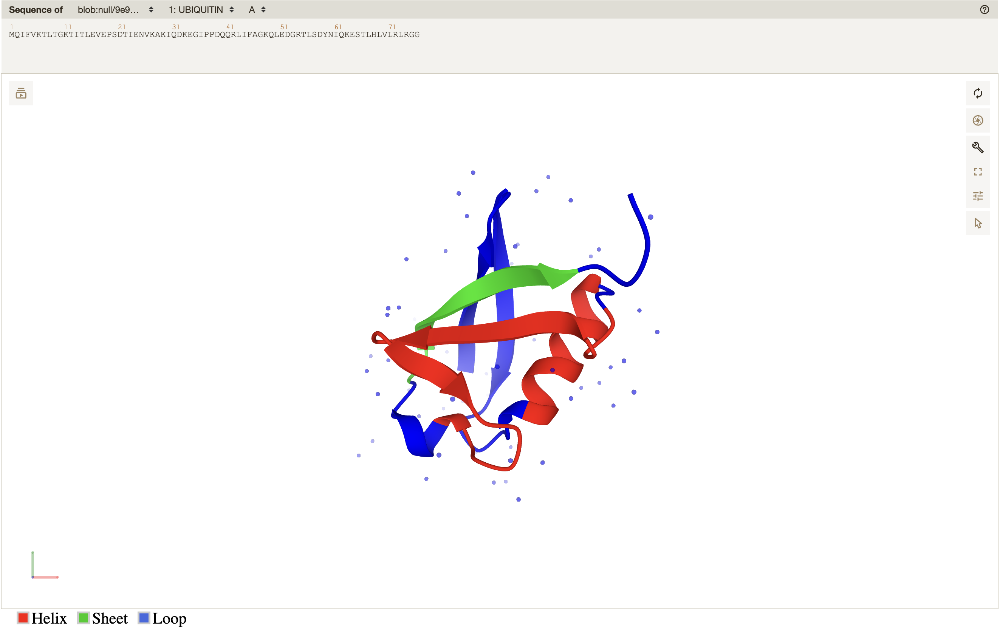

# (Temp)
- need to add the details about what is in everyone's files, so need individual inputs
- we can clean up the files (like CFParams.txt/CFparameters.txt, i think only one of them is required) a bit if they are not needed (can put the non-required ones in the miscellaneous folder)

# SSPT
Outdated Secondary Structure Tool using Golang.

# About Files and Directories:
- `main.go` - Main file for the program. Contains the main function in which we call the algorithm-executing functions.
- `datatypes.go` - Custom datatypes used throughout the project. 
- `CFparameters.txt` - Parameters file (Chou-Fasman) for testing purposes.
- `aa_index_map.txt` - Amino acid index map for Chou-Fasman algorithm.
- `functions_shashank.go` - Functions for visualizing the secondary structure in 2D and 3D.
- `functions_jon.go` - Testing grounds for Jon's contributions to the project. Currently focusing on CF2.
- `functions_andrew.go` - CF6 and visualization testing
- `functions_rohit.go` - Functions for reading and writing to files.
- `SSPT` and `SSPT.exe` - Executable files for the program for Mac and Windows.
- `3d_visualization_resources` - Contains the pdbs and template html required for the 3d visualization.
- `output_files` - Contains the output files (2D plots, 3D html, and downloaded fastas of the ensembls provided).
- `miscellaneous` - Contains the miscellaneous files that are not required for the program to run, but were used in the development process.

# Usage
- To run the program, the gget package must be installed. Open terminal (create a new conda environment if needed) and run:
```
pip install --upgrade gget
```
- Then, clone the repository by executing the following. This will create a new folder called SSPT in your current directory.
```
git clone https://github.com/AndrewLutsky/SSPT.git
```
- Also, the go graphics package must be installed for the 2D visualization to work. Go the cloned repository's directory and run:
```
go get -u github.com/fogleman/gg
```
- To build the executable file for the program, run:
```
go build
```
- Finally run:
```
./SSPT    #for MacOS
SSPT.exe  #for Windows
``` 
- The program will prompt you to choose from three modes of operation: `array`, `FASTA`, or `DNA`. Type in the mode you want to run (case-sensitive) and press enter.

  - `array` mode will prompt you to enter a comma separated list of ensembl IDs. The program will then download the FASTA and PDB corresponding to each ensembl ID and run the algorithm on each protein sequence.
  - `FASTA` mode will prompt you to enter the path to a FASTA file. The program will then run the algorithm on each protein sequence in the file.
  - `DNA` mode will prompt you to enter the path to a DNA file. The program will then perform ORF analysis on the DNA sequence and run the algorithm on each protein sequence in the file.

An Example could be:
```
array
ENST00000546271.1
```
- The ouputs will appear in the `outputs` directory. The 3d visualization is supported only in `array` mode. The 2d visualization is supported in all modes.

# Example Outputs

On Ubiquitin, the program outputs the following 2D visualization:



and the following 3D visualization:



# Authors:
- Jon Potter
- Shashank Katiyar
- Andrew Lutsky
- Rohit Nandakumar

# Dependencies:
- github.com/fogleman/gg
- github.com/pachterlab/gget

